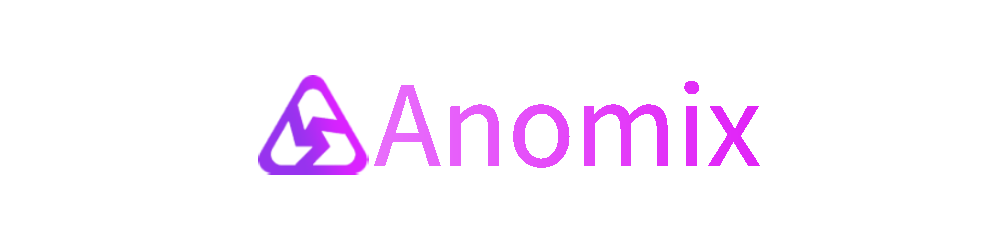

# Anomix Network - A zk-zkRollup layer2 solution on Mina, focusing on Privacy and Scalablility

# Overview
Anomix Network, **formerly called 'Shadow' in zkApp Builders Program 1**,  is a zk-zkRollup layer2 solution on Mina, focusing on Privacy&Scalablility. It grows up alongside with the upgrade of SnarkyJS.

Within Anomix Network, you will get a totally new L2 account derived from L1 account, and any one could not link L2 account with L1 account unless it obtains the private key of L1 account, meaning any of your operations in Anomix Network could neither be linked with L1 account.

With aid of Anomix Network, you could benefit from `anonymous & private` fund operations, such as `depositing fund from L1, withdrawing fund to L1, transferring fund to any one within L2`, etc. No body could trace your funds circulation, because all sensitive parts about your operations happen on your local devices (leveraging zero knowledge proof) and all your status info are also stored within L2 network under solid encryption.

Besides, As a layer2, Anomix Network batches L2 txs to make fee apportioned(much lower cost), and furthermore it’s easy to build private defi/nft/DID, etc.

Tips: Within zkIgnite cohort1, We will provide a zkApp, named as [Ano-Cash](https://github.com/anomix-zk/ano-cash-zkapp), as the officially first entry of Anomix Network.

# Background
Viewed by our team, Currently on Mina, there are two points needing improvement -- **Privacy** and **Scalability**. 

### Privacy Issue:

**We are not anonymous and our on-chain activities are not private.**

We could see all on-chain states and transaction history of any addresses on MINA chain, which means all on-chain activities are public, including what you did, what you are doing, or even what you will do.

This is not expected by common users, high-level players especially, because our fund operations and investment strategies (like defi/nft) are exposed to the whole world. Well, You must know about unfair treatments like ‘FrontRunning/SandwichAttack of MEV’ on Ethereum.

Further, It's not really difficult for professional Data analysis parties or companies to link all related addresses and infer the real-world owner behind them.

To enhance on-chain privacy and improve censorship-resistant properties, we need to solve transaction's privacy on the chain.  

### Scalability Issue:

The scalability issue of the Mina chain is mainly reflected in the following two aspects:

*1. Increasing transaction flow*

Currently, though Mina's nominal block confirmation time is about 3 minutes, it's uncertain that each slot generate a block smoothly, which results in that total confirmation time of each block is over 5 minutes and further leads to bad user experience.

Although recursive zkproof works well to make Mina ledger much slim, we could foresee **the heavy/busy tx traffic** as the number of users grows up and **inevitable network congestion**.

Actually this is the common issue of most public blockchains. Take Ethereum as an example, Layer2 solutions are hot currently focusing on scalablility improvement, like Sidechains, Rollup, etc. All Layer2 solutions try to migrate as many tx as possible to  reduce tx traffic on mainnet(layer1).

*2. Limited state’s capacity on each zkApp account*

Unlike solidity contract, Each zkApp account provides 8 fields of 32 bytes each of arbitrary storage. You are able to store anything here as long as it fits in the size provided. If the states are anticipated to be larger than this, then you need off-chain state instead.

For larger data, we consider storing the root of a Merkle tree (or similar data structure) within your zkApp’s on-chain storage that references additional off-chain state stored elsewhere, such as IPFS or Arweave.

Here, However, our zkApp meets a new challenge -- **Data Race**! Concurrent updates (from numbers of users) upon the states based on the same merkle root must break data consistence. To guarantee data consistence, We need to solve the Race Condition. Mutex? Synchronization? Actions&Reducer? Or else? Up to your design.

On one hand, if we overcome data race by Mutex or Synchronization, we meet another challenge -- **Poor User Experience**. Only one L1 tx could succeed each time, while other concurrent L1 txs (upon the same Merkle Root) all fails. Pls notice, each L1 tx costs, in spite of failure.

On the other hand, Actions&Reducer mechanism is a good solution, but might not fit all zkapps, since it normally works on Layer1, which means zkapps’ performance is still affected(limited) by the main network.

It can be seen that solving the scalability issue is one of the necessary conditions for Mina chain and zkApps especially to serve a large number of users.

# Solution
To enhance privacy protection and scalability, we team design a zk-zkRollup-style Layer2, based on native ZK-capability on Mina. It is named as Anomix Network.

At the very beginning, Anomix acting as an sub-ledger of Mina main ledger, could migrate numbers of tx(ie. users' operations, such as common transfers/Defi/NFT activities, etc.) from mainnet into Layer2, but keep as safe as that on mainnet. Besides, Anomix internally batches numbers of L2 txs into one L1 tx on mainnet to make them finalized, which leads to much lower-cost of each L2 tx.

What’s magic, Your are totally anonymous and your asset txs are totally private within Anomix. No worry any longer about privacy exposure and unfair treatment upon MEV.

What’s bright, based on designated architecture on Anomix, you could easily build private Defi/NFT/DID/DAOs, etc.

# Features
To achieve the capabilities above,  Anomix has these basic features:

1) L2 account maintenance

Anomix's L2 account is designed as 'Unique ID + Multi-Level Keys'.

An L2 account is generated initially from L1 account, but cannot be linkable to L1 account by any one except owner itself.

Besides, we could register a unique account alias(as an ID). **Anyone could send assets to you directly by your unique alias!**
In addtions, you could maintain your L2 account, such as keys updates, account migration, as well as **Social Recovery**!

2) Deposit L1 assets into L2;

Any Mina L1 account can make a deposit to any Anomix L2 account. None could find out who on L2 will receive the assets.

3) Transfer assets within Anomix;

Powered by zkp, all sensitive fields on tx are not exposed publicly, including ‘from’, ‘to’, ‘amount’, etc. But what's magic, the recipient of the tx could clearly/quickly receive the incoming assets.

Besides, Just send assets directly by registered recipients’ unique alias!! Regarding unregistered accounts, senders could only send it by their keys.

4) Withdraw L2 assets back to L1.

None could find out who on L2 just did it.

5) ESCAPE Windows

Users could make a quick&safe ESCAPE if L2 breaks down, to always protect assets safety.

6) Lower cost

L2 txs are processed in a batch to make fee apportioned.

7) Scale dynamically.

Powered by recursive zkp, Anomix can be scaled dynamically to support more and more L2 txs as the number of users increases.

8) Support Private Defi/NFT/DID/DAO, etc.

The designated Architecture of Anomix holds the capability to support private Defi, NFT, DID, etc. Making all your on-chain activities invisible & untraceable!!

# Index

## Summary
- [Intro](./intro.md)

## Architecture
- [Architecture & Flows](./architecture_and_flow.md)
- [Cryptographic Primitives](./primitives.md)
- [Notes & Nullifiers](./notes_and_nullifiers.md)

## Client-side Circuits
- [Join-Split Circuit](./join_split_circuit.md)
- [Account Circuit](./account_circuit.md)
- [Anatomy-of-A-L2-User-Tx](./anatomy_of_a_L2_user_tx.md)

## Rollup Circuits
- [Rollup Circuit](./rollup_circuit.md)
  - [Inner rollup Circuit](./innerRollupCircuit_design.md)
  - [Outer rollup Circuit](./outerRollupCircuit_design.md)

## Contracts
- [Rollup Contract](./rollup_contract.md)

## Ano-Cash
- [Ano-Cash](./ano-cash_design.md)

## SDK
- [SDK](./sdk.md)